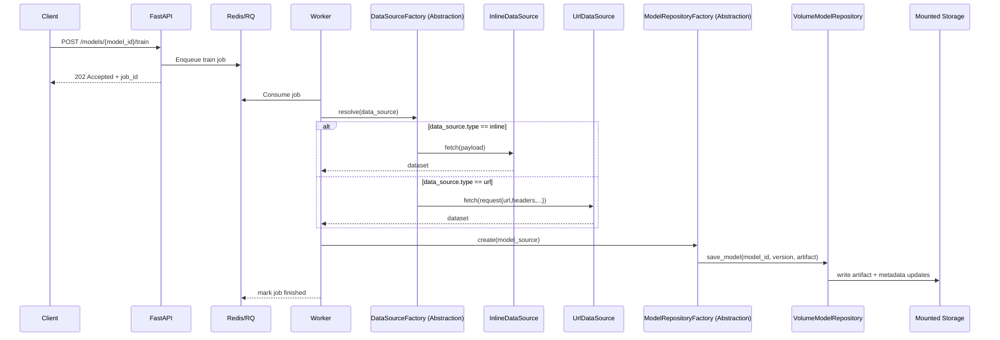
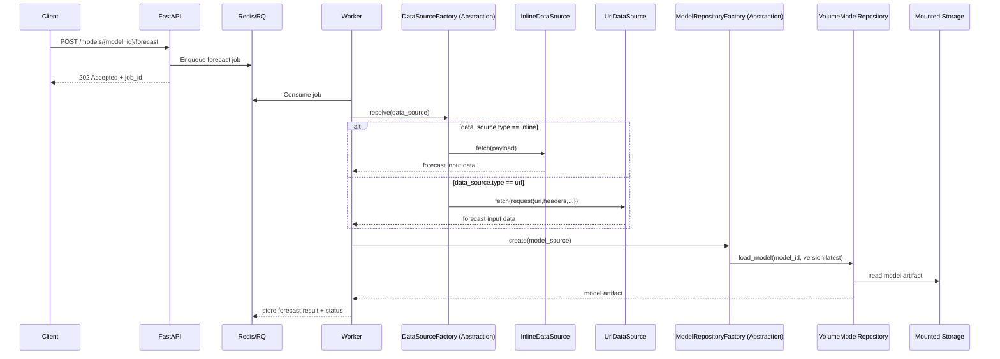
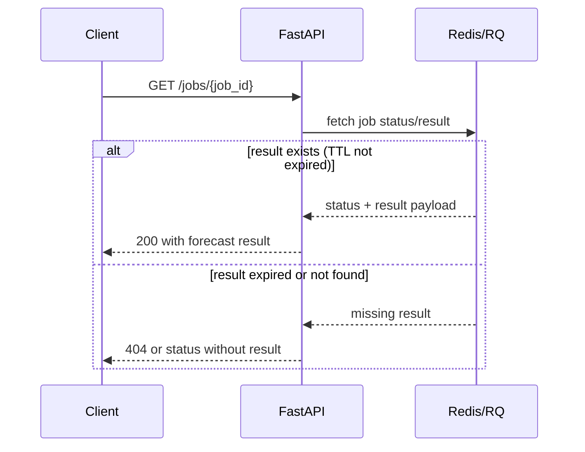

# Service Workflow Explanation

This document explains what happens when using the API for:
- creating a model
- training a model
- forecasting
- retrieving forecast results

It also includes sequence diagrams for the two data input cases:
- data provided directly in the request body (`inline`)
- data fetched from an external API (`url`)

## 1. Create Model

Endpoint:
- `POST /api/v1/models`

What happens:
1. API receives model metadata (for example `model_id`, target, freq).
2. Metadata is stored in `storage/metadata/<model_id>.json`.
3. Model is now available in:
- `GET /api/v1/models`
- `GET /api/v1/models/{model_id}`

No training is executed in this step.

## 2. Train Model (Asynchronous)

Endpoint:
- `POST /api/v1/models/{model_id}/train`

What happens:
1. API validates request.
2. API enqueues a training job in Redis (RQ).
3. API returns immediately with `job_id`.
4. Worker consumes the job.
5. Worker resolves the data source using the abstraction layer (`DataSourceFactory`).
6. Worker runs training via the `u2` core library (`u2_train`).
7. Worker persists the artifact through the model repository abstraction (`ModelRepositoryFactory`) — by default under `storage/models/...`.
8. Worker updates model versions in metadata.

## 3. Forecast (Asynchronous)

Endpoint:
- `POST /api/v1/models/{model_id}/forecast`

What happens:
1. API validates request.
2. API enqueues a forecast job.
3. API returns `job_id`.
4. Worker resolves input data via the abstraction layer.
5. Worker loads the model from the model repository abstraction.
6. Worker computes the forecast via the `u2` core library (`u2_predict`).
7. Job result is stored in Redis for a limited time.

## 4. Retrieve Forecast Result

Endpoint:
- `GET /api/v1/jobs/{job_id}`

What happens:
1. API queries Redis/RQ job status.
2. If job is completed and result TTL has not expired, response includes the forecast result under `detail.result`.
3. If TTL expired, job result may no longer be available in Redis.

`status` is normalized to a backend-independent vocabulary — `queued`,
`running`, `succeeded`, or `failed` — so a client polls for the same values
regardless of backend (see `JobStatus` in `app/schemas/common.py`).

Sync vs async contract:
- With `JOBS_BACKEND=redis` (default), `/train` and `/forecast` return `202` with a `job_id`; poll `GET /jobs/{job_id}` until `status` is `succeeded`/`failed`, then read `detail.result`.
- With `JOBS_BACKEND=memory`, the job runs in-process and the `/train`/`/forecast` response already contains `status: "succeeded"` and the inline `result` — there is no `job_id` to poll.

Important persistence note:
- model artifacts and metadata are persisted in mounted storage
- forecast job result is transient in Redis (bounded by the result TTL)

## Sequence Diagram A: Train with Abstraction Layer (Inline or URL Data)

## Sequence Diagram B: Forecast with Abstraction Layer (Inline or URL Data)

## Sequence Diagram C: Retrieve Forecast Result

